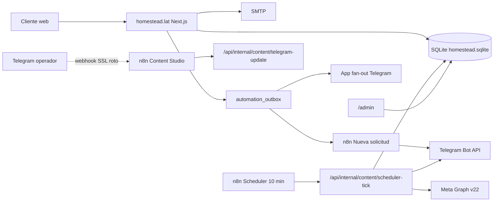

# 00 — Resumen ejecutivo

**Fase:** descubrimiento y diseño. No se construyó la app nueva. No se modificó producción.  
**Observación VPS:** 2026-10-02 19:43–19:46 America/Panama (`2026-10-03T00:43Z`–`00:46Z`). Host `vmi3027483`, `homestead_web` + n8n 2.3.6.  
**Observación local:** 2026-10-02, repo `C:\Proyectos\HOMESTEAD SERVICES`, rama `main` @ `7a962dcd`.

Leyenda usada en toda la carpeta:

| Estado | Significado |
| --- | --- |
| **VERIFICADO** | Leído en código, Postgres n8n, SQLite `mode=ro`, `printenv` (nombres/flags) o `getWebhookInfo` (URL/error). |
| **PARCIAL** | Existe evidencia, pero falta ejecución reciente, volumen o un acceso. |
| **HISTÓRICO** | Certificación o auditoría con fecha. No certifica el presente. |
| **NO ENCONTRADO** | Se buscó en las rutas indicadas y no aparece. |
| **BLOQUEADO** | Falta un acceso o un servicio está impedido. |

“Verificado en código” no equivale a “verificado en ejecución”.

---

## Qué tenemos realmente funcionando

| Capacidad | Estado | Evidencia | Consecuencia |
| --- | --- | --- | --- |
| Sitio público homestead.lat + health | **VERIFICADO** | `GET https://homestead.lat/api/health` y loopback `127.0.0.1:3091` → HTTP 200. Nginx `homestead.conf` (`server_name homestead.lat`). | El sitio y el proceso Next.js están vivos. |
| App Next.js 16.3.1 / React 19 en Docker | **VERIFICADO** | Contenedor `homestead_web` healthy, imagen `homestead-homestead_web`, creado `2026-09-22T14:00:26Z`, up ~10 días. `package.json` local `next@16.3.1`. | Runtime de producto = contenedor, no el working tree sucio local. |
| SQLite de negocio | **VERIFICADO** | `/opt/apps/homestead/data/homestead.sqlite` integrity `ok` (lectura `mode=ro`, incluye WAL). 65 tablas. WAL activo `2026-10-02 19:40`. | Fuente de verdad única de Homestead. |
| n8n 2.3.6 + 5 workflows Homestead **activos** | **VERIFICADO** | `n8n --version` = 2.3.6. `workflow_entity`: Content Scheduler, Content Studio, Analytics, Weekly Marketing, Nueva solicitud. | “Activo” ≠ “funcionando”. Ver filas siguientes. |
| Scheduler cada 10 min | **VERIFICADO** | 982 ejecuciones `success` en ventana retenida; última `2026-10-02 19:40:33-05`. `automation_engine_state.last_scheduler_at` = `2026-10-03T00:40:33Z`. | El tick llega a Homestead: outbox, ops, retención, autónomo, contenido, recordatorios. |
| Publicación Meta en vivo (no solo simulación) | **VERIFICADO** | `CONTENT_DRY_RUN=false`, `content_settings.dry_run=0`. 12 filas `content_publications` `dry_run=0 status=PUBLISHED` (IG+FB para HC-018, 024, 038, 040, 042, 043). Token e IDs Meta = SET. | Ya no estamos en el dry-run global de la certificación del 22-sep. El scheduler **puede** publicar. |
| Outbox de automatización | **VERIFICADO** | 52 eventos, todos `DELIVERED`. `AUTOMATION_DISPATCH_ENABLED=true`. | La cola interna entrega. No hay backlog. |
| Concierge web (IA) | **PARCIAL** | `AI_CONCIERGE_ENABLED=true`, `AI_CONCIERGE_DRY_RUN=false`. 8 conversaciones, 66 mensajes. | Código + datos existen; no se reprodujo un chat en esta fase. |
| Admin web `/admin/*` | **PARCIAL** | Rutas en repo: dashboard, solicitudes, clientes, citas, trabajos, retención, copilot, operadores. Auth por sesión. | Existe; no se inició sesión (evitar cookies/secretos). |
| Telegram **salida** (Homestead → operador) | **PARCIAL** | `TELEGRAM_BOT_TOKEN=SET`. El scheduler y el dispatcher llaman Bot API desde la app. `last_daily_brief_at` = `2026-10-02T13:00:33Z`. | La app puede enviar. No se envió nada en esta auditoría. |
| Telegram **entrada** (operador → bot) | **BLOQUEADO** | Webhook actual: `https://n8n.autonomousflow.lat/webhook/homestead-content-studio`. `getWebhookInfo.last_error_message` = `SSL error … certificate verify failed` (`last_error_date` ≈ 2026-10-01 13:31 America/Panama). Último `content_telegram_updates` = `2026-09-24T13:46:47Z`. Workflow Content Studio **0 ejecuciones** en la ventana de 7 días. | `/homestead`, fotos y aprobaciones **no están certificables hoy**. El panel está cableado, pero Telegram no entrega updates. |

---

## Qué solo estaba planteado o está vacío en datos

| Capacidad | Estado | Evidencia | Consecuencia |
| --- | --- | --- | --- |
| Cotizaciones HQ- / trabajos de campo HJ- | **PARCIAL** | Tablas `revenue_quotes` (0), `revenue_jobs` (0), `job_photos` (0). Código en `revenue-store.ts` / `job-store.ts`. Cert Wave C **HISTÓRICO** 2026-08-22. | El ciclo lead → cotización → trabajo **no opera** con volumen real. |
| Reseñas / mantenimientos / referidos | **PARCIAL** | Tablas en 0. Comandos Telegram `/reseñas` `/mantenimientos` leen snapshot. | UI existe; no hay negocio detrás. |
| Daily/Weekly Revenue n8n | **NO ENCONTRADO** en n8n vivo | JSON en `n8n/homestead-n8n-daily-briefing.json` y `weekly-revenue.json`. Inventario Postgres: no importados. El brief diario lo hace la **app** en el tick. | No importar esos JSON: duplicarían el tick. |
| Recolector de métricas Meta | **VERIFICADO** como no-op | Workflow activo, 13 éxitos; `analytics-collect/route.ts` siempre `collected: 0`. | Corre y no mide. |
| Reels / video / carrusel | **VERIFICADO** ausente | Publicador JPEG único; `carousel_unsupported` en `content-publish.ts`. Botón carrusel = aviso. | No construir carrusel en la app nueva sobre este publicador. |
| 9TG_GATEWAY_V1 | **VERIFICADO** inactivo | `active=false`, 0 ejecuciones, no es el webhook del bot. | No reutilizar. No activar. Es BrokerPro. |
| Wave D / “todo en n8n” | **HISTÓRICO** | Wave B/C certs: “no new n8n”; master audit 2026-08-22 STOP. | La lógica vive en Homestead. n8n es proxy + cron. |

---

## Quién hace qué hoy

| Superficie | Rol real | No hace |
| --- | --- | --- |
| **Aplicación Homestead** | Fuente de verdad, motor de contenido/campañas/ops/concierge, dispatcher, publicación Meta, SMTP, Bot API de salida, admin web. | No es orquestador cron por sí sola (depende del tick de n8n salvo que se añada un timer propio). |
| **n8n** | Webhook de solicitudes → Telegram; proxy inbound Telegram; cron 10 min / 12 h / 7 d hacia APIs internas. | No genera copy, no aprueba, no escribe SQLite, no publica en Meta, no es el Command Center. |
| **Telegram** | Superficie de operador (comandos + callbacks) cuando el webhook entrega. | No es base de datos. No debe ser la única UI de aprobación si el webhook falla. |
| **Admin web** | Solicitudes, citas, clientes, trabajos, retención, operadores, copilot. | **No** tiene cola de Content Studio ni campañas (eso está solo en Telegram). |

---

## Dónde vive cada dato

Una sola base de negocio: SQLite `/opt/apps/homestead/data/homestead.sqlite` (+ WAL). Archivos en `data/photos`, `data/content`, `data/concierge`, `data/jobs`.  
n8n usa PostgreSQL propio (`n8n_postgres`, DB `n8n`) solo para workflows/ejecuciones.  
Detalle en `04-DATOS-Y-FUENTES-DE-VERDAD.md`.

---

## Problemas conocidos: demostrado vs hipótesis

| Incidencia | Causa demostrada | Hipótesis no demostrada |
| --- | --- | --- |
| Aprobar y no publicar | **VERIFICADO:** HC-025…028 aprobados 22-sep, fallaron Graph `pages_read_engagement / pages_manage_metadata / pages_read_user_content` el 24–30 sep; quedaron `NEEDS_REVIEW`. HC-047…051 y HC-054 `APPROVED` con slot pasado; el scheduler **solo** toma `SCHEDULED` (`content-scheduler.ts`). | Token Meta “vencido” vs permisos de Page; no se llamó Graph en esta auditoría. |
| 5–6 fotos, solo parte del lote | **HISTÓRICO + datos:** lotes `HB-2026-000001`…`000008` existen. HB-001 (HC-029…033) quedó `SCHEDULED` a futuro (5–14 oct). Código local `content-photo-batch.ts` (debounce 1.8 s, 1 HC por foto). | No se reprodujo un álbum (haría inbound Telegram). |
| Publicación masiva | **VERIFICADO** en política: `max_posts_per_day=1`, `min_hours_between_posts=36`, ventana 18:00–20:00 America/Panama. 6 piezas live distintas, no un dump simultáneo. | — |
| Conflicto aprobación / horario / versión / DRY RUN | **VERIFICADO:** `CONTENT_DRY_RUN` contenedor = `false` (antes `true` en cert 22-sep). Aprobación versionada `cs:{HC}:…:vN`. `live_once` solo para `/live`. | Comportamiento de un callback vencido **hoy** no se puede probar (webhook SSL). |
| Solicitud registrada ≠ cita confirmada | **VERIFICADO** en modelo: folio `HS-` en `service_requests`; cita `HA-` en `revenue_appointments` (2 filas). Son entidades distintas. | No se trazó un HS concreto a un HA (PII). |
| Inbound Telegram muerto | **VERIFICADO:** SSL del webhook n8n + 0 updates desde 24-sep + 0 exec Content Studio. | Causa raíz del certificado (Nginx n8n / Let’s Encrypt) no se tocó. |

---

## Cómo conectar una app nueva sin duplicar

1. La app nueva es **otro cliente** del backend Homestead, no un segundo motor ni un cliente de la API admin de n8n.  
2. Toda mutación (aprobar, programar, publicar, marcar contactado) debe pasar por las mismas funciones que ya usa Telegram (`tryApproveContentJob`, `publishJob`, `ops-store`, outbox).  
3. Idempotencia existente: `automation_outbox.idempotency_key`, `content_publications.idempotency_key`, `content_telegram_updates.update_id`, version suffix en callbacks.  
4. Telegram se conserva como canal; no se registra un segundo bot ni un segundo webhook.  
5. n8n se mantiene delgado: cron + 2 webhooks. No se importan Daily/Weekly Revenue. No se activa BrokerPro / `9TG_GATEWAY_V1`.

Recomendación de producto (justificada en `06-PROPUESTA-NUEVA-APP.md`): **web responsive que extiende `/admin`**, no Mini App ni nativo en el MVP.

---

## Qué construir primero / accesos que faltan

**Primero (MVP):** cola web de Content Studio + campañas (hoy solo Telegram) + estados de publicación/error + subida de lotes, reutilizando APIs internas con sesión admin.  
**En paralelo operativo (fuera de esta fase):** restaurar el certificado TLS de `n8n.autonomousflow.lat` o el webhook no volverá a entregar. Hacer ejecutable el cron de backup (hoy `Permission denied`).  
**No primero:** cotizaciones, jobs de campo, reseñas, recolector Meta, carrusel, Mini App.

**Accesos no usados / no necesarios para cerrar esta fase:** login admin en navegador, UI n8n, Graph live, envío de mensajes.  
**Pendiente explícito:** causa del SSL de n8n; si el token Meta actual ya tiene los permisos que faltaron el 24–30 sep; restore drill de backup (nunca evidenciado off-box).

Documentos:

1. `01-INVENTARIO-CODIGO-PROMPTS-VPS.md`  
2. `02-INVENTARIO-N8N.md`  
3. `03-PANEL-TELEGRAM-Y-FUNCIONES.md`  
4. `04-DATOS-Y-FUENTES-DE-VERDAD.md`  
5. `05-FLUJOS-E-INCIDENCIAS.md`  
6. `06-PROPUESTA-NUEVA-APP.md`  
7. `07-BACKLOG-Y-BLOQUEOS.md`  
