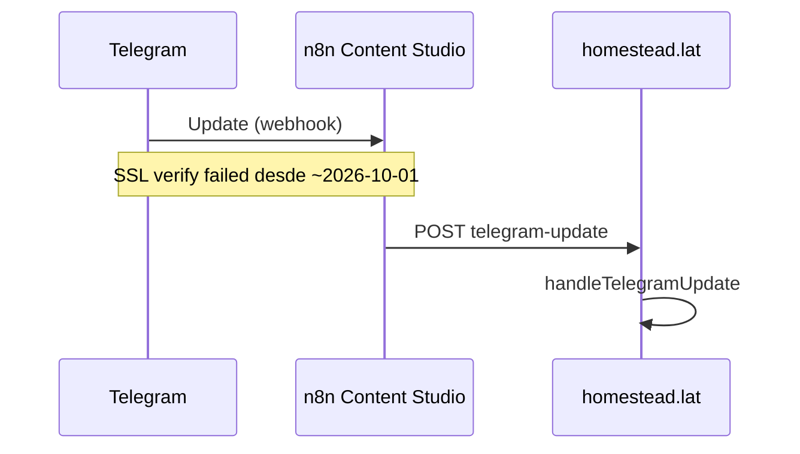

# 02 — Inventario n8n

**Instancia:** `https://n8n.autonomousflow.lat` · contenedor `n8n_n8n` (`n8nio/n8n:2.3.6`) + `n8n_postgres`.  
**Observación:** 2026-10-02 19:44 America/Panama. Lectura Postgres `SELECT` only. No se activó, importó ni ejecutó ningún workflow.  
**Paginación:** `SELECT … FROM workflow_entity ORDER BY name` — 16 filas, inventario completo (no hay segunda página).

---

## 1. Plataforma

| Ítem | Valor | Estado |
| --- | --- | --- |
| Versión | 2.3.6 | **VERIFICADO** `n8n --version` |
| Health | `{"status":"ok"}` en `127.0.0.1:8083/healthz` | **VERIFICADO** |
| Modo | in-process (compose sin Redis/queue) | **HISTÓRICO** master audit 2026-08-22; compose sigue `n8n_n8n` único |
| Persistencia | Postgres `n8n` / user `n8nuser` · volumen `n8n_postgres_data` | **VERIFICADO** |
| TZ | America/Panama (docs + timestamps `-05`) | **PARCIAL** (timestamps de exec) |
| Credenciales `credentials_entity` | COUNT = 0 | **VERIFICADO** |
| Variables (nombres) | `HOMESTEAD_WEBHOOK_SECRET`, `TELEGRAM_BOT_TOKEN`, `TELEGRAM_WEBHOOK_SECRET`, `HOMESTEAD_TELEGRAM_CHAT_ID` · tabla `variables` | **VERIFICADO** |
| `$env` en Code | bloqueado en 2.3.6 | **HISTÓRICO** + comentado en `internal-auth.ts` |
| HMAC inbound | n8n no firma; Homestead acepta secret+timestamp | **VERIFICADO** código |
| Acceso UI | no se abrió (evitar sesión) | **BLOQUEADO** por diseño de esta fase |

`active: false` en `n8n/*.json` de Git es **artefacto de export**, no el flag vivo.

---

## 2. Todos los workflows

| Nombre | ID | Activo | Exec retenidas | Última exec | Homestead | Estado funcional |
| --- | --- | --- | --- | --- | --- | --- |
| HOMESTEAD — Content Scheduler | `nGiCm9Yt3PzPzDP9` | sí | 982 success | 2026-10-02 19:40:33-05 | sí | **VERIFICADO funcionando** |
| HOMESTEAD — Content Studio | `x9PZMUr4NNvvlv8i` | sí | 0 | never (ventana 7 d) | sí | **Activo, no funcionando** — ver §4 |
| HOMESTEAD — Marketing Analytics Collector | `ZiQfUIPtEq3RsqVW` | sí | 13 success | 2026-10-02 12:00:26-05 | sí | **Activo, efecto vacío** |
| HOMESTEAD — Weekly Marketing Report | `aSGBqm6D5SjSsYGL` | sí | 1 success | 2026-09-27 00:00:00-05 | sí | **PARCIAL** (una corrida) |
| HOMESTEAD — Nueva solicitud → Telegram | `i4t4Bw8JTQB8A2KE` | sí | 0 | never (ventana 7 d) | sí | **Activo, sin tráfico reciente** |
| HOMESTEAD — Daily Business Briefing | — | no en vivo | — | — | JSON Git only | **NO ENCONTRADO** en `workflow_entity` |
| HOMESTEAD — Weekly Revenue Report | — | no en vivo | — | — | JSON Git only | **NO ENCONTRADO** en `workflow_entity` |
| 1BP_ERROR_LOGGER_V1 … 7BP_FOLLOWUP_CANCEL_V1 | varios | no | 0 | never | BrokerPro | **VERIFICADO** inactivo |
| 9TG_GATEWAY_V1 | `lZo2mOnDpunIv6MRchSttsSyF2lym1XUvvzh` | **no** | 0 | never | BrokerPro Telegram Trigger | **VERIFICADO** no es el webhook Homestead |
| PT Bot Mentor v2 | `2x6h1fcy4isK-OCTYGg0i` | no | 0 | never | no | ignorar |
| My workflow / test1 | `H5IB…` / `mmq-…` | no | 0 | never | no | ignorar |

ID histórico Content Studio `l10Rh1i8NDrdkfUa` (audit 22-ago): **reemplazado**. El webhook path no cambió.

Webhooks vivos (`webhook_entity`):

| Path | Método | Workflow |
| --- | --- | --- |
| `homestead-content-studio` | POST | Content Studio |
| `homestead-service-request` | POST | Nueva solicitud |

No hay otros webhooks. **VERIFICADO.**

---

## 3. Ficha por workflow Homestead

### 3.1 HOMESTEAD — Nueva solicitud → Telegram

| Campo | Valor |
| --- | --- |
| Propósito | Recibir `service_request.created` y avisar al chat admin |
| Trigger | Webhook POST `homestead-service-request` |
| Protección | Header secreto vs `$vars.HOMESTEAD_WEBHOOK_SECRET` (nodos IF/Code). Path público sin el secreto es insuficiente. |
| Nodos | Validate event → idempotencia → format HTML → `sendMessage` / `sendPhoto` / `sendMediaGroup` |
| Tablas | Ninguna Homestead. Lee payload HTTP. |
| Credencial | `$vars.TELEGRAM_BOT_TOKEN`, `$vars.HOMESTEAD_TELEGRAM_CHAT_ID` |
| Efecto externo | Telegram al chat principal |
| Errores / idempotencia | Dedup en el workflow (doc producto). App también tiene outbox + fan-out extra operadores |
| Última exec | **0 en 7 días** |
| Solape | App `fanOutServiceRequestTelegram` tras el mismo evento (`automation-dispatch.ts`) |
| Estado | **PARCIAL.** Activo. Sin solicitudes nuevas recientes (6 `service_requests` totales). Outbox histórico `DELIVERED`. |

Export: `n8n/homestead-n8n-telegram-workflow.json`.

### 3.2 HOMESTEAD — Content Studio

| Campo | Valor |
| --- | --- |
| Propósito | Proxy Telegram Update → Homestead |
| Trigger | Webhook POST `homestead-content-studio` (este es el webhook del bot) |
| Protección | `x-telegram-bot-api-secret-token` vs `$vars.TELEGRAM_WEBHOOK_SECRET`; Homestead revalida secret+timestamp + token Telegram (`telegram-update/route.ts`) |
| Nodos | Auth → HTTP POST `https://homestead.lat/api/internal/content/telegram-update` |
| Subworkflows | no |
| Efecto | Toda la operación del bot (comandos, fotos, callbacks) |
| Última exec | 0 en ventana |
| `getWebhookInfo` | URL correcta; **SSL certificate verify failed** (~2026-10-01 13:31 Panama); `pending_update_count=0` |
| Estado | **BLOQUEADO** para inbound. Activo en Postgres no basta. |

Export: `n8n/homestead-n8n-content-studio.json` (el `id` del JSON no coincide con el vivo; el path sí).

### 3.3 HOMESTEAD — Content Scheduler

| Campo | Valor |
| --- | --- |
| Propósito | Tick de Homestead |
| Trigger | Schedule **10 min** |
| HTTP | POST `/api/internal/content/scheduler-tick` body `{ event: 'content.scheduler.tick' }` + secret + timestamp |
| Qué dispara en la app | outbox drain, ops engine, retention, autonomous scan, **publish due**, hot leads, appointment reminders, chequeo webhook |
| Telegram on fail | nodo alerta (JSON) |
| Estado | **VERIFICADO funcionando** (982/982 success en muestra) |

Riesgo: SPOF. Si n8n para, no hay tick ni publicaciones programadas ni drain. No hay timer systemd Homestead. **VERIFICADO** por ausencia.

### 3.4 Marketing Analytics Collector

| Campo | Valor |
| --- | --- |
| Trigger | 12 h |
| HTTP | POST `/api/internal/content/analytics-collect` |
| Efecto real | `collected: 0` siempre (`analytics-collect/route.ts` L21–28) |
| Estado | **VERIFICADO** cron sano, negocio no implementado |

### 3.5 Weekly Marketing Report

| Campo | Valor |
| --- | --- |
| Trigger | 7 d |
| HTTP | POST `/api/internal/content/weekly-report` |
| Efecto | Telegram resumen marketing (código app) |
| Última | 2026-09-27 |
| Estado | **PARCIAL** |

### 3.6 Daily briefing / Weekly revenue (Git)

Implementados como JSON. **No importar.** El brief diario ya corre en el tick (`last_daily_brief_at` 2026-10-02). Duplicarían notificaciones.

---

## 4. Content Studio: activo ≠ funcionando

Evidencia cruzada:

- Webhook URL **correcta** (**VERIFICADO** `getWebhookInfo`).  
- Workflow **active=true** (**VERIFICADO**).  
- 0 ejecuciones n8n en 7 días (**VERIFICADO**).  
- Último `content_telegram_updates.created_at` = 2026-09-24T13:46:47Z (**VERIFICADO**).  
- Error SSL reciente (**VERIFICADO**).

Conclusión: no se puede certificar el panel Telegram **hoy**. El scheduler (otro workflow) sigue sano.

`9TG_GATEWAY_V1` no interviene: inactivo, 0 exec, no aparece en `webhook_entity`. El bot no usa Telegram Trigger de n8n.

---

## 5. Muestra de ejecuciones (existentes, no nuevas)

Se leyeron las 50 más recientes Homestead: **todas** Content Scheduler `success` el 2026-10-02 cada 10 min, más 1 Analytics a las 12:00.  
Errores Homestead en ventana: **0** (solo esos tres workflows tienen filas).  
Content Studio y Nueva solicitud: sin muestra reciente — **no se dispararon pruebas**.

---

## 6. Dependencias y solapes

| Proceso | Dueño | Solape |
| --- | --- | --- |
| Aviso solicitud | n8n chat principal + app fan-out operadores | Doble envío posible si hay varios destinos; mismo evento outbox |
| Inbound bot | n8n proxy → app | Único. Si n8n/SSL cae, el bot no recibe |
| Publicar / SLA / brief / rescue | app en el tick | n8n solo despierta |
| Meta Graph | app `content-publish.ts` | n8n no llama Graph |
| BrokerPro | inactivo | **No activar** — riesgo de webhook Telegram ajeno |

---

## 7. Implicación para la app nueva

- Hablar con Homestead (`/api/admin/*` o nuevas rutas de sesión), **nunca** con `n8n.autonomousflow.lat/api/v1`.  
- Tratar el scheduler n8n como cron externo. Un fallback (cron host o interval en la app) es backlog de resiliencia, no MVP de UI.  
- Restaurar TLS de n8n es prerrequisito del bot, no de la web.
