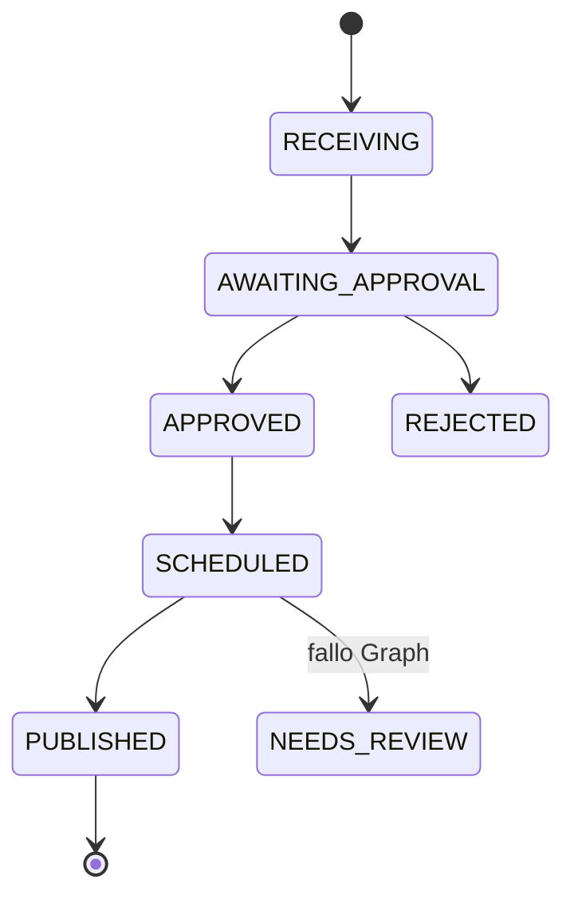

# 04 — Datos y fuentes de verdad

**Motores reales (2026-10-02 19:43 America/Panama):**

| Motor | Ubicación | Consumidores | Estado |
| --- | --- | --- | --- |
| SQLite negocio | `/opt/apps/homestead/data/homestead.sqlite` (+ WAL/SHM) | `homestead_web` only | **VERIFICADO** integrity `ok` `mode=ro` |
| Postgres n8n | `n8n_postgres` DB `n8n` | solo n8n | **VERIFICADO** |
| Archivos | `data/photos`, `data/content`, `data/concierge`, `data/jobs` | app | **VERIFICADO** dirs |
| Sesiones admin | cookie httpOnly (`admin-auth.ts`) | `/admin` | **VERIFICADO** código |
| Cola | tabla `automation_outbox` (no Redis) | dispatcher en el tick | **VERIFICADO** 52 DELIVERED |

No hay segunda DB de Homestead. **NO ENCONTRADO:** Mongo, MySQL Homestead, Redis Homestead.

Consultas: `COUNT` y agregados. Sin dumps de PII.

---

## 1. Conteos vivos (65 tablas)

Selección operativa:

| Tabla | n | Lectura |
| --- | --- | --- |
| service_requests | 6 | folios HS- |
| service_request_messages | 12 | |
| revenue_appointments | 2 | HA- |
| revenue_leads | 6 | lead_id = HS- |
| revenue_customers | 6 | |
| revenue_followups | 6 | |
| revenue_quotes / jobs / reviews / maintenance / referrals | 0 | ciclo comercial vacío |
| content_jobs | 43 | HC- |
| content_photo_batches | 8 | HB- |
| content_photo_intake | 20 | |
| content_assets / versions / publications / events | 157 / 38 / 38 / 199 | |
| content_telegram_updates | 213 | 2026-09-01 → 2026-09-24 |
| campaigns / pieces / clicks | 2 / 12 / 1 | CM-001 test cancelada; CM-002 SCHEDULED |
| automation_outbox | 52 | todos DELIVERED |
| telegram_operators | 2 | OWNER+ADMIN |
| concierge_conversations / messages | 8 / 66 | |
| operational_signals | 6 | |
| retention_actions / job_photos | 0 | |

---

## 2. Folios

| Prefijo | Entidad | Counter | Estado |
| --- | --- | --- | --- |
| HS-YYYY-NNNNNN | solicitud / lead_id | `request_counters` | **VERIFICADO** |
| HC-YYYY-NNNNNN | pieza contenido | `content_counters` | **VERIFICADO** (hasta HC-058 + HC-099 test) |
| HB-YYYY-NNNNNN | lote fotos | `content_batch_counters` | **VERIFICADO** |
| CM- / CP- | campaña / pieza campaña | `campaign_counters` | **VERIFICADO** |
| HQ- | cotización | `revenue_quote_counters` | código; 0 filas |
| HJ- | trabajo | `revenue_job_counters` | código; 0 filas |
| HA- + 8 hex | cita | random | **VERIFICADO** patrón código |

---

## 3. Fuente de verdad por entidad

| Entidad | SoT | Secundario | No es SoT |
| --- | --- | --- | --- |
| Solicitud | `service_requests` | mensajes, outbox, n8n exec | Telegram, admin cache |
| Cita | `revenue_appointments` | `revenue_appointment_notices` | “solicitud registrada” |
| Lead pipeline | `revenue_leads` + `revenue_customers` | followups, events | marketing_leads (atajo `/lead`) |
| Quote / job | `revenue_quotes` / `revenue_jobs` | job_photos | botones vacíos |
| Contenido | `content_jobs` + versions + assets | files `data/content` | n8n |
| Lote | `content_photo_batches` + intake | | |
| Publicación red | `content_publications` (idempotency_key) | permalink/external_id | status del job (puede desfasarse: HC-040) |
| Campaña | `campaigns` + `campaign_pieces` | clicks/events | |
| Automatización | `automation_outbox` | audit (0 filas) | |
| Operador | `telegram_operators` | env seed break-glass | username Telegram |
| Concierge | `concierge_*` | files | |
| Señales autónomas | `operational_signals` | | |
| Workflows | Postgres n8n | JSON Git | |

Migraciones: `service-requests.ts` `migrate()` + satélites (`autonomous/schema.ts`, `copilot/schema.ts`, `retention-engine.ts`). Un solo archivo SQLite.

---

## 4. Estados de contenido (los que importan a la app)

Observados:

`RECEIVING` (no en conteo actual) → process → `AWAITING_APPROVAL` (3) / `NEEDS_REVIEW` (11) → `APPROVED` (6) → `SCHEDULED` (5) → `PUBLISHED` (5) / `SIMULATED` (2) · `REJECTED` (2) · `CANCELLED` (9).

**Hueco VERIFICADO:** el scheduler (`content-scheduler.ts` L86) solo lista `SCHEDULED`. Jobs `APPROVED` con `recommended_publish_at` pasado (HC-047…051, 054) **no se publican solos**.

Publicaciones: 12 live PUBLISHED, 20 live FAILED (permisos Page), 6 SIMULATED.

Cadencia settings: 1/día, 36 h, no pause, dry_run 0.

Zona: timestamps ISO UTC en DB; reglas de negocio America/Panama.

---

## 5. Unicidad e idempotencia

| Clave | Tabla |
| --- | --- |
| `public_id` UNIQUE | requests, content_jobs, campaigns, pieces, batches |
| `idempotency_key` UNIQUE | `automation_outbox`, `content_publications` |
| `update_id` PK | `content_telegram_updates` |
| `deduplication_key` | `operational_signals` |
| `notice_key` | `revenue_appointment_notices` |
| Slot cita abierto | índice histórico Wave A `idx_rev_appt_open_slot` (**HISTÓRICO** cert; no re-verificado pragma aquí) |

---

## 6. Fotos / videos

| Tipo | Dónde | Retención |
| --- | --- | --- |
| Solicitud | `data/photos/HS-…/photo-NN.jpg` + `photos_json` | no hay TTL en código |
| Contenido | `content_assets.relative_path` bajo `data/content` | originales se conservan al rechazar (doc CS) |
| Concierge | `data/concierge` | |
| Job campo | `data/jobs` + `job_photos` | 0 |
| Video | — | **NO ENCONTRADO** |

URLs firmadas HMAC para n8n (`/api/media/request-photos`). Admin sirve con sesión. **No se listaron URLs firmadas.**

---

## 7. n8n vs Homestead

n8n no es fuente de solicitudes ni de contenido. Borrar n8n **no borra** SQLite; deja de despertar el tick y el inbound Telegram.

---

## 8. Implicación

La app nueva lee/escribe **este** SQLite vía backend Homestead. No conectar el navegador a `homestead.sqlite` ni a Postgres n8n. Migrar de motor (Postgres propio) es opcional y **posterior**; “app desde cero” no exige migrar la base.
