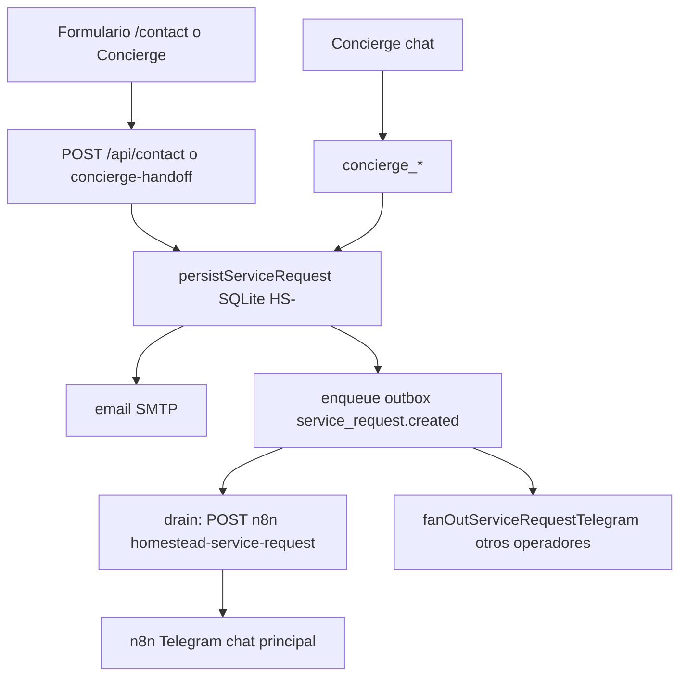
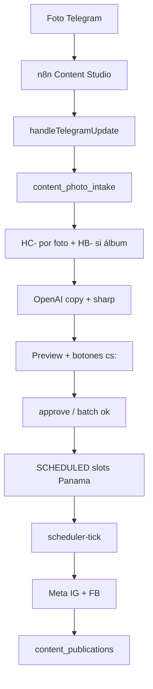

# 05 — Flujos de negocio e incidencias

**Código:** 2026-10-02. **VPS/SQLite/n8n:** 2026-10-02 19:43–19:46 America/Panama.  
No se reprodujeron publicaciones, mensajes ni formularios.

Pasos marcados **AUSENTE** no existen en código o no tienen datos.  
Causas **demostradas** vs **hipótesis** van explícitas.

---

## 1. Cliente → chat/formulario → solicitud → folio → notificación

| Paso | Evidencia | Estado |
| --- | --- | --- |
| Formulario | `src/app/api/contact/route.ts` → `persistServiceRequest` | **VERIFICADO** código |
| Folio HS- | `request_counters` | **VERIFICADO** |
| Fotos ≤6 | `MAX_PHOTOS` en `photos.ts` | **VERIFICADO** código |
| Email | `mail.ts` + `SMTP_PASS=SET` | **PARCIAL** (no se envió) |
| Outbox | 52 DELIVERED | **VERIFICADO** |
| n8n aviso | workflow activo, **0 exec / 7 d** | **PARCIAL** — sin solicitudes nuevas |
| Concierge → lead | `AI_CONCIERGE_DRY_RUN=false`, 8 conversaciones | **PARCIAL** |
| WhatsApp inbound | — | **AUSENTE** (solo `wa.me` salida) |

---

## 2. Solicitud → disponibilidad → cita → reprogramar/cancelar

| Paso | Evidencia | Estado |
| --- | --- | --- |
| Disponibilidad concierge | `concierge-availability.ts`, calendar tools | **VERIFICADO** código |
| Cita HA- | `revenue_appointments` n=2 | **VERIFICADO** datos |
| Reprogramar / cancelar | motores `appointment-reprogram.ts`, `service-request-cancellation.ts` | **VERIFICADO** código |
| Cancelar cita desde Telegram Wave B | doc: no | **HISTÓRICO** / **AUSENTE** en Command Center |
| Recordatorios 24 h / 2 h | tick → `runAppointmentReminders`; `revenue_appointment_notices` n=2 | **PARCIAL** |
| Solicitud ≠ cita | entidades distintas HS- vs HA- | **VERIFICADO** modelo |

---

## 3. Lead → seguimiento → cotización → trabajo

| Paso | Evidencia | Estado |
| --- | --- | --- |
| Lead = HS- | `revenue_leads.lead_id` | **VERIFICADO** |
| Follow-ups | 6 filas | **PARCIAL** |
| Rescue / SLA | `ops-engine` en cada tick; `last_ops_engine_at` fresco | **PARCIAL** (motor corre; valor de negocio no muestreado) |
| Cotización HQ- | tabla 0 | **AUSENTE** en operación |
| Trabajo HJ- + fotos | 0 | **AUSENTE** en operación |
| Post-service / reseña | flags Wave C; `HOMESTEAD_REVIEW_URL` históricamente unset | **HISTÓRICO** + tablas 0 |
| Job → Content Studio | `createContentFromJob` en `cc:o` | Código; sin jobs no corre |

---

## 4. Foto/video → contenido → revisión → aprobación → programación → publicación

| Paso | Evidencia | Estado |
| --- | --- | --- |
| Inbound foto | código + 20 intake + 8 HB | Código **VERIFICADO**; inbound **hoy BLOQUEADO** |
| 1 propuesta / foto | jobs 029–033, 045–051, 055–058 | **VERIFICADO** datos |
| Video | — | **AUSENTE** |
| Aprobación versión | `:vN`, `approved_version` | **VERIFICADO** código |
| Programación | settings 18–20 Panama, 36 h, 1/día | **VERIFICADO** settings + slots 029–033 |
| Publicación live | 12 PUBLISHED dry_run=0 | **VERIFICADO** |
| Simulación | 6 SIMULATED | **VERIFICADO** |
| Carrusel | aviso only | **VERIFICADO** código |

---

## 5. Error → registro → reintento → resolución

| Capa | Mecanismo | Estado |
| --- | --- | --- |
| Outbox | claim/lease, backoff, replay admin | **VERIFICADO** código; audit table 0; todos DELIVERED |
| Publicación | `idempotency_key` por plataforma; `selectRetryPlatforms`; no re-publica already | **VERIFICADO** código |
| Graph fail | `content_publications.error` + job → `NEEDS_REVIEW` | **VERIFICADO** HC-025…028 |
| Tick aislado | scheduler catch → `content: failed_isolated` no tumba ops | **VERIFICADO** código |
| Replay | `POST /api/admin/automation/replay` | **VERIFICADO** código; **no ejecutado** |
| Resolución humana | Telegram `NEEDS_REVIEW` / admin | inbound roto |

---

## 6. Acción Telegram → backend → persistencia → respuesta

| Paso | Quién | Estado |
| --- | --- | --- |
| Update | Telegram → n8n → Homestead | **BLOQUEADO** SSL |
| Auth | secret Telegram + internal + gateOperator | código |
| Mutación | funciones TS + SQLite | código |
| Respuesta | `sendTelegramMessage` / `editMessageText` desde **app** (no n8n) | código |
| n8n en el callback | solo el proxy inbound | |

---

## 7. Incidencias históricas

### 7.1 Aprobar en Telegram y no publicar

**Demostrado**

1. **Permisos Meta.** HC-025…028 (campaña CM-002) `approved_at` 2026-09-22, slots 24–30 sep, `content_publications` FAILED ambos platforms: `pages_read_engagement, pages_manage_metadata, pages_read_user_content`. Jobs quedaron `NEEDS_REVIEW`.  
2. **Estado APPROVED ≠ SCHEDULED.** HC-047…051 y HC-054 aprobados 23–24 sep con `recommended_publish_at` ~25 sep; siguen `APPROVED`. El tick no los toma (`listJobsByStatus(["SCHEDULED"])`).  
3. **Inbound muerto.** Desde 24-sep no hay updates; un “aprobar” hoy ni llega.  
4. **Desfase job vs publication.** HC-040 tiene PUBLISHED en ambas redes y el job sigue `NEEDS_REVIEW`.

**Hipótesis:** token de Página sin scopes de publicación en esas fechas; o publicación por un actor que no transicionó el job. No se llamó Graph para comprobar scopes actuales.

**No es la causa de 025–028:** DRY RUN (esas filas son `dry_run=0`).

### 7.2 Cinco o seis fotos, solo parte del lote

**Demostrado en datos:** HB-001 agrupa HC-029…033 (5), todos `SCHEDULED` a futuro (5–14 oct) — lote recuperado/programado, no publicado. HB-002 (035–036) `AWAITING_APPROVAL`. HB-003: 037 espera, 038 publicado. HB-006: mezcla APPROVED + NEEDS_REVIEW.

**Código actual:** debounce 1.8 s, 1 HC/foto, recover `photo-batch-recover` (no invocado aquí).

**Hipótesis del fallo original (sep):** flush antes de juntar el álbum, o webhook parcial. No se reenviaron fotos.

### 7.3 Publicación masiva

**Demostrado que el sistema lo evita:** `max_posts_per_day=1`, `min_hours_between_posts=36`, slots escalonados en `assignStaggeredSlots`. 6 piezas live distintas en días distintos, no un blast.

**Hipótesis de “masiva”:** varias simulaciones + varios FAILED Graph se perciben como “se publicó todo”; las FAILED no son posts públicos.

### 7.4 Aprobación / horario / versión / DRY RUN

**Demostrado**

- Cert 22-sep: `CONTENT_DRY_RUN=true`. Hoy contenedor y `content_settings.dry_run=0`.  
- `live_once` solo autoriza source `"live"` si el settings siguiera en dry-run (`content-publish-policy.ts`). Con dry-run false, scheduler y “ahora” publican de verdad.  
- Callbacks viejos: versión distinta → stale, no publica otra versión.

**Hoy no comprobable:** pulsar un botón (webhook).

### 7.5 Solicitud registrada vs cita confirmada

**Demostrado en modelo y conteos:** 6 solicitudes, 2 citas. Crear HS- no crea HA-. El concierge puede crear ambos en turnos distintos. El admin de solicitudes no es el calendario.

---

## 8. Correlación de IDs (sanitizada)

| ID | Estado job | Publicación | Lote / campaña |
| --- | --- | --- | --- |
| HC-018 | PUBLISHED | IG+FB live | — |
| HC-024 | PUBLISHED | IG+FB live | CM-002 |
| HC-025…028 | NEEDS_REVIEW | FAILED permisos | CM-002 |
| HC-029…033 | SCHEDULED oct 5–14 | ninguna | HB-001 |
| HC-038, 042, 043 | PUBLISHED | IG+FB live | HB-003 / 005 |
| HC-040 | NEEDS_REVIEW | IG+FB PUBLISHED | HB-004 — inconsistente |
| HC-047…051, 054 | APPROVED | — | HB-006/007 — atascados |
| CM-001 | CANCELLED | is_test=1 | |
| CM-002 | SCHEDULED | piezas mixtas | |

Logs de contenedor no se volcaron (PII). Eventos `content_events` 22–30 sep.

---

## 9. Qué falta comprobar (sin publicar)

1. Scopes actuales del Page token (lectura Graph `debug_token` / permisos — no hecha).  
2. Tras arreglar TLS n8n: un `/estado` de operador.  
3. Por qué HC-040 no pasó a PUBLISHED.  
4. Restore real de un backup (el cron no corre).  
5. Camino formulario → n8n con una solicitud de prueba `is_test=1` — **no creado** (escribiría DB).
