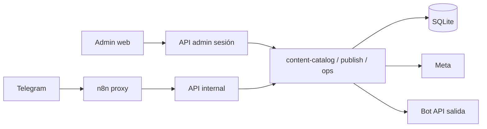

# 06 — Propuesta para la nueva aplicación

Solo después del inventario. **No implementada.** Reutiliza el backend Homestead. No reconstruye SQLite ni n8n.

---

## 1. Comparación de canal

| Criterio | Web responsive / PWA sobre `/admin` | Telegram Mini App | App nativa iOS/Android |
| --- | --- | --- | --- |
| Encaje con lo verificado | Admin web **ya existe** para solicitudes, citas, clientes, trabajos. El hueco es Content Studio / campañas. | El bot **ya es** la UI de contenido, pero el inbound está **caído por SSL**. Mini App sigue dependiendo de Telegram. | Cero código móvil. |
| Coste | Bajo-medio: nuevas rutas Next.js + APIs de sesión que delegan a `content-*` / `campaign-*` / `ops-*`. | Medio: WebApp + bridge `initData` + mismos APIs. No arregla TLS. | Alto: dos stores, push, paridad. |
| Permisos | Reutilizar `admin-auth` + roles `telegram_operators` o un rol web. | Reutilizar `telegram_user_id`. | Nuevo IAM. |
| Archivos / lotes | `<input type=file multiple>` + mismo intake que fotos de solicitud. | Telegram ya envía álbumes (cuando el webhook vive). | Nativo es mejor cámara; innecesario para MVP. |
| Convivencia Telegram | Misma SoT SQLite; acciones idempotentes. | Riesgo de dos UIs Telegram. | Tercer cliente. |
| Offline / campo técnico | PWA suficiente. | Requiere Telegram abierto. | Mejor, fase 3. |

**Recomendación:** **web responsive (PWA opcional) que extiende el admin Next.js actual.**  
Justificación: el costo de Mini App o nativo no añade motor; el dolor real es que la operación de contenido **solo** vive en un bot cuyo webhook está roto. Una cola web usa el backend que **sí** está sano (tick, SQLite, Meta). Telegram se queda como canal, no como única consola.

No conectar el navegador a SQLite ni a la API admin de n8n.

---

## 2. Qué se reutiliza / adapta / nace

| Pieza | Decisión |
| --- | --- |
| `homestead.sqlite` + WAL | **Reutilizar.** No migrar en el MVP. |
| Motores `content-catalog`, `content-publish`, `content-photo-batch`, `campaign-engine`, `ops-store`, outbox | **Reutilizar** vía funciones internas. |
| `/admin` shell + auth cookie | **Adaptar** (nav + nuevas páginas). |
| n8n 5 workflows | **Reutilizar** como cron/proxy. No clonar. |
| Bot y webhook actuales | **Reutilizar.** Un bot. |
| Prompts OpenAI | **Reutilizar** (`content-openai`, concierge). No un tercer prompt de publicación. |
| UI Telegram callbacks | **No clonar** en web; exponer acciones con nombres de dominio (`approveJob`, `scheduleJob`). |
| Mini App / stores | **No** en MVP. |
| Daily/Weekly n8n JSON | **No importar.** |

Lógica en **backend Homestead:** estados, cadencia, claims, publicación, outbox, RBAC.  
Lógica en **n8n:** despertar y proxy.  
Lógica en **UI:** presentación, confirmaciones, progreso de lote.

---

## 3. Módulos

### MVP (construir primero)

1. **Cola de contenido** — lista HC- por estado, preview, error Graph, versión.  
2. **Aprobación y programación** — aprobar versión exacta, slot Panama, “publicar esta ahora” / `/live` equivalente con confirmación.  
3. **Lotes** — subida múltiple → N propuestas HC- + HB-; progreso; no silent carousel.  
4. **Campañas** — CM-002 y siguientes: piezas, aprobar/pausar, resultados.  
5. **Centro de fallos** — `content_publications` FAILED + jobs APPROVED atascados + HC-040 inconsistente.  
6. **Convivencia** — badge “también en Telegram”; misma idempotencia.

### Después

7. Unificar solicitudes/citas ya existentes en el mismo shell (polish, no reescritura).  
8. Cotizaciones / trabajos de campo cuando existan datos.  
9. Métricas Meta reales (hoy `collected: 0`).  
10. PWA + push web.  
11. Fallback cron si n8n cae.  
12. Mini App solo si los operadores no abren el admin.

---

## 4. Matriz función → pantalla → API → workflow → datos → permisos → esfuerzo

| Función actual | Pantalla nueva | Acción | API | Workflow n8n | Datos | Permiso | Esfuerzo |
| --- | --- | --- | --- | --- | --- | --- | --- |
| `/homestead` | `/admin` (ya) | ver conteos | existente dashboard | tick (ops) | requests, leads, appts | sesión admin | S |
| `/hoy` `/agenda` | `/admin/citas` (ya) | ver / (futuro) mover | `admin/appointments` | reminders en tick | `revenue_appointments` | admin | S |
| `/leads` `/calientes` | dashboard + detalle solicitud | contactar, snooze | `ops/action` **adaptar** a sesión (hoy internal) | tick SLA | `revenue_leads` | admin / sales | M |
| `/trabajos` | `/admin/trabajos` (ya) | — | `admin/jobs` | — | 0 filas | admin | S (vacío) |
| `/pendientes` | **nueva** `/admin/contenido` | listar | **nueva** `GET /api/admin/content/jobs` | — | `content_jobs` | `content.read` | M |
| `/programadas` `/publicadas` `/proxima` `/estado` | misma + drawer | filtrar | misma | scheduler | jobs + settings | read | S |
| `/pausa` `/reanudar` | settings contenido | toggle | **nueva** `POST /api/admin/content/settings` | — | `content_settings` | `content.approve` | S |
| `/publicar` + fotos | **nueva** `/admin/contenido/nuevo` | upload N fotos | **nueva** `POST /api/admin/content/intake` → `content-photo-batch` | no | intake, HC, HB | `content.read` | L |
| Aprobar / rechazar / slot / now | detalle HC- | mutar | **nueva** `POST /api/admin/content/jobs/:id/action` → `tryApproveContentJob` / `publishJob` | no (publish live vía app) | jobs, versions, pubs | `content.approve` | L |
| `/live` | modal “PUBLICAR EN VIVO” | `confirm=LIVE` | reutilizar política `publish-live` **con sesión**, no solo internal | no | `live_once` | approve | M |
| Lote HB aprobar | detalle lote | `approvePhotoBatch` | **nueva** `POST /api/admin/content/batches/:id/approve` | no | batches | approve | M |
| Carrusel | aviso estático | ninguno | — | — | — | — | S |
| `/campana` … | **nueva** `/admin/campanas` | plan/aprobar/pausar | **nueva** `/api/admin/campaigns` → `campaign-engine` | no | `campaigns` | read/approve | L |
| `/seguimientos` `/cotizaciones` | más tarde o bloque “revenue” | — | revenue-store | — | 0 quotes | — | diferir |
| `/clientes` | `/admin/clientes` (ya) | — | customer-360 | — | customers | admin | S |
| `/reseñas` `/mantenimientos` | no MVP | — | — | — | 0 | — | diferir |
| `/copilot` | `/admin/copilot` (ya) | chat | `admin/copilot/chat` | — | copilot_* | admin | S |
| Formulario cliente | sitio (ya) | crear HS- | `/api/contact` | Nueva solicitud | requests + outbox | público | — |
| Tick publicación | invisible | due jobs | internal scheduler-tick | **Content Scheduler** | settings, pubs | n8n secret | no UI |
| Inbound bot | Telegram (ya) | igual | telegram-update | **Content Studio** | updates | webhook | ops TLS |

Esfuerzo: S ≤ 2 días, M ~1 semana, L >1 semana (un implementador que ya conoce el repo).

---

## 5. Contratos preliminares

Todas las rutas nuevas: sesión admin (misma cookie). **No** `verifyInternalHomesteadRequest` desde el browser.

```text
GET  /api/admin/content/jobs?status=&cursor=
     200 { jobs: [{ publicId, status, version, recommendedPublishAt, batchId, campaignId, lastError, platforms: [{platform, status}] }] }

POST /api/admin/content/jobs/:publicId/action
     body { action: "approve"|"reject"|"schedule"|"publish_now"|"live", version, slot?, confirm? }
     200 { ok, already?, stale?, status }
     409 { error: "stale_version"|"already_published"|"cadence_blocked"|"paused" }
     202 { error: "publishing", jobId }     // si se espera tick

POST /api/admin/content/intake
     multipart files[] + note
     202 { batchId, publicIds[], missing[] }

POST /api/admin/content/batches/:batchId/approve
     200 { approved[], stale[], already[], published[], slots[] }

GET/POST /api/admin/campaigns ...
     mismos estados que campaign-engine (no duplicar)
```

Asíncrono: intake + OpenAI = 202 + poll `GET …/jobs?batchId=`. No bloquear HTTP 60 s.  
Errores de Graph: persistir en `content_publications.error` (sanitizado en UI).  
Idempotencia: `Idempotency-Key` opcional = `admin:{user}:{action}:{publicId}:{version}`.

Estados de UI alineados a la DB: no inventar “Enviado a n8n”.

---

## 6. AuthZ

| Actor | Web | Telegram | Notas |
| --- | --- | --- | --- |
| Admin sitio | `ADMIN_PASSWORD` hoy (un secreto) | — | Insuficiente para multi-rol a medio plazo |
| Operador | **Fase 2:** login por operador mapeado a `telegram_operators.role` | RBAC actual | Evitar dos matrices |
| n8n | internal secret | — | Nunca al browser |
| Meta / OpenAI / SMTP | solo server env | — | |

MVP puede seguir con sesión admin única **si** solo el dueño usa la web. En cuanto entre un rol CONTENT, mapear permisos `content.approve` igual que Telegram.

---

## 7. Convivencia app ↔ Telegram (sin duplicar)

1. Una SoT: SQLite.  
2. Una función de aprobación. Web y `cs:…:approve` llaman `tryApproveContentJob`.  
3. Versionado: la web envía `version`; stale → 409, igual que callback `:vN`.  
4. Lotes: `approvePhotoBatch` único.  
5. Publicación: `publishJob` único; cadencia única.  
6. Dedup Telegram `update_id` no aplica a la web; usar idempotency_key de publicación.  
7. No segundo webhook. No segundo bot.  
8. Si el operador aprueba en web, el mensaje Telegram viejo queda stale — aceptable (ya ocurre al regenerar).  
9. Notificar por Telegram *después* de mutar (fan-out existente), no al revés.



---

## 8. Archivos y lotes

- Reusar validación de `photos.ts` / intake de `content-photo-batch.ts`.  
- Un request HTTP puede traer N archivos; el servidor crea N HC- + un HB-.  
- Progreso: estados intake `received → attached → processed`.  
- No agrupar en carrusel salvo acción explícita futura (hoy: texto de no soporte).  
- No re-publicar HC- ya `PUBLISHED` (el batch approve ya los salta).

---

## 9. Secretos

Solo servidor. La web nunca ve `TELEGRAM_BOT_TOKEN`, `META_PAGE_ACCESS_TOKEN`, `OPENAI_API_KEY`, `N8N_HOMESTEAD_WEBHOOK_SECRET`. Media: URLs de admin con sesión, no HMAC de n8n en el browser.

---

## 10. Plan gradual, validación, reversión

| Fase | Qué | Validación | Reversa |
| --- | --- | --- | --- |
| 0 — ops | TLS n8n + bit +x backup (fuera de la app) | `getWebhookInfo` sin SSL error; cron `BACKUP_OK` | — |
| 1 | `GET` cola contenido (solo lectura) | Comparar conteos con `/pendientes` cuando el bot vuelva | quitar rutas |
| 2 | approve/schedule/reject web | Canary `is_test` o HC ya FAILED; **no** live | pause + dry_run settings |
| 3 | intake web | 2 fotos test → 2 HC-; no Graph | cancel jobs |
| 4 | campañas web | CM-002 piezas en review | pauseCampaign |
| 5 | live confirm | una pieza `/live` equivalente | pause global |

Feature flag `ADMIN_CONTENT_UI=true`. Rollback = flag false; Telegram (si TLS ok) sigue. No migración de datos que deshacer.

Validación: tests unitarios ya existentes (`test-content-studio-v3.mjs`, `test-campaign-engine.mjs`, photo-batch behavior) + canary `is_test=1`. No usar el scheduler de producción como banco de pruebas.

---

## 11. Lo que “desde cero” no significa

No reescribir el concierge, el outbox, el publicador Meta ni n8n.  
No mover SoT a la app cliente.  
No activar BrokerPro ni `9TG_GATEWAY_V1`.  
No importar Daily Briefing n8n.
